# PR #132 — course-management usability and read-concurrency repair

## Baseline and boundaries

Re-fetched `develop` and `codex/scientific-vp-course-management` before work and
again before delivery: feature head `27f6e8d08abc2117c93245c351c10fa1a57b801c`,
develop `6f9b2f2582a8dce42b86b3d9637a082826e9703d`. No concurrent remote changes
were overwritten. This repairs the same PR; no merge, deployment or production SQL.

**The manual preflight/apply/verify package is unchanged by this correction.**
No new table, trigger, permission, dependency, academic rule or plan version.
The package introduced by the original PR still needs isolated MariaDB rehearsal
and the deployment sequence documented in the main feature report.

## What is simpler

- One existing `DataTable`, one row per course ID, server count/sort/pagination.
  No repeated rows when a course belongs to several programs. The selected
  program adds classification/advisory columns; other memberships are in details.
- Main add/search/college/department/program controls; secondary filters collapsed.
  Details, editing and deletion are dialogs instead of long inline editor panels.
- “إضافة مادة للبرنامج” offers an existing course or a new course. Context is
  retained. Creation commits only the course and explicitly reports that the
  program link is **not** complete; a separate operator action and confirmation
  perform that link. No automatic second write or duplicate global course.
- Scope + mandatory/elective resolve exactly one active matching group on the
  server. The older optional group ID is accepted only as a consistency assertion,
  never as authority. Missing/inactive/ambiguous matches reject with no writes.
  The UI explains the problem and links to requirement settings. No third selector.
- “متطلبات التخرج” is a separate compact table: scope, type, required hours,
  available hours and activity. Internal codes/names are preserved for existing
  groups; new internal labels are server-generated only on explicit settings save.
  Required hours must be supplied explicitly. GETs create no groups. Linking a
  course never changes required graduation hours.
- “إزالة من البرنامج” deletes membership only; “حذف المادة” is a separate,
  confirmed, capability-checked operation. Used programs show an early lock reason;
  allowed name/description corrections remain editable.

## Existing visual references (unmodified)

| Element | Reference actually inspected and rendered |
| --- | --- |
| Scientific VP header/list | `frontend/src/features/vice-presidency/pages/SemesterOfferingQueue.jsx`; header also audited against `TeachingAssignmentQueue.jsx` |
| Shared list/filter/pagination | `frontend/src/components/table/DataTable.jsx`, `FilterBar.jsx` |
| Course fields and row action buttons | `frontend/src/features/exam-board/pages/CoursesPage.jsx` |
| Native confirmation typography/focus/escape | `frontend/src/features/exam-board/components/ManualGradeDialog.jsx` |
| Wide, scrollable editor geometry | `frontend/src/features/dean-dashboard/components/DeanTimetableDialog.jsx` |

`CatalogControls` retains only feature-specific form/dialog/lookup behavior where
there is no suitable shared primitive; the main table/filter/pagination are reused.
Dialog fields explicitly use normal line height: inherited dialog prose leading
otherwise made them taller than the rendered reference inputs. Optional prerequisite
editing is collapsed, without resetting its draft or changing validation.
The permanent rule is in `frontend/AGENTS.md`. No shared/global styling changed.

### Direct desktop/mobile comparisons

Reference pages use intercepted synthetic data. The new page screenshots below
use the built React app connected to **real local Laravel + temporary SQLite**,
with test authentication, not a production login. Dialog reference fixtures render
the existing components unchanged. Screenshots were inspected visually as well as
checked for document overflow and viewport-contained dialogs.

| Existing reference | Repaired interface |
| --- | --- |
| 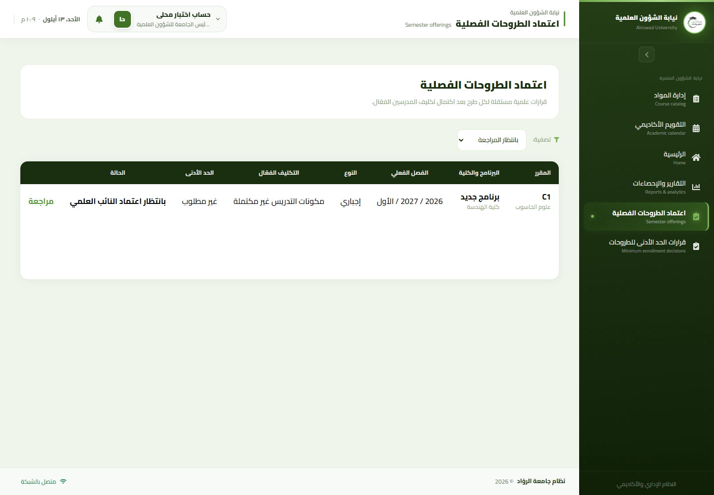 | 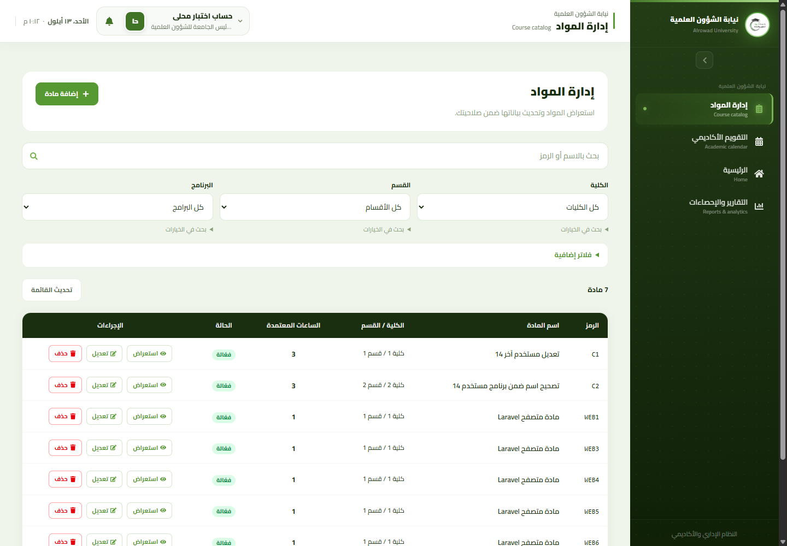 |
| 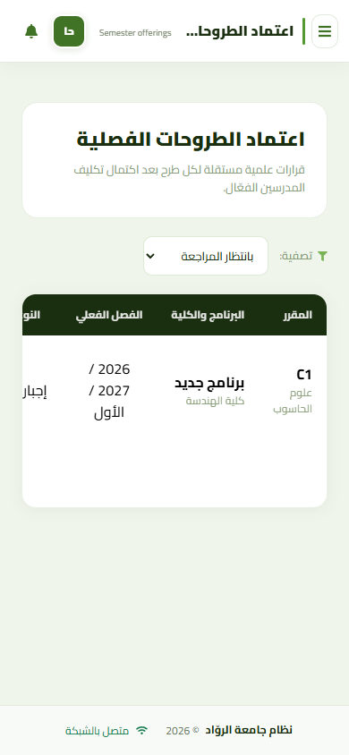 | 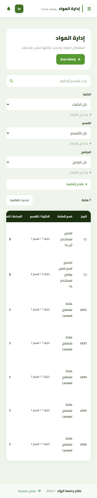 |
| 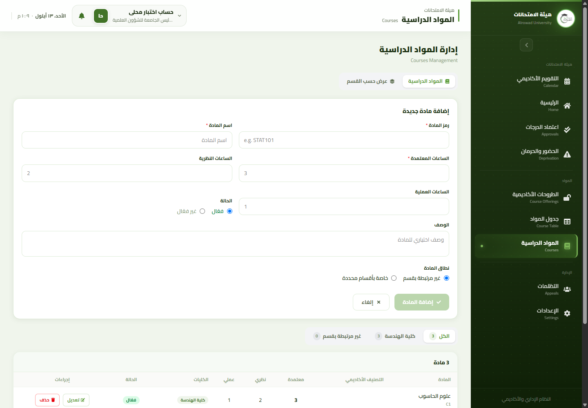 | 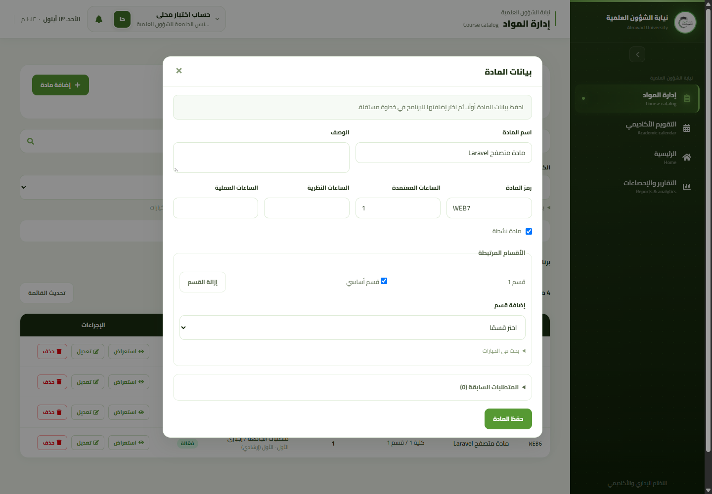 |
| 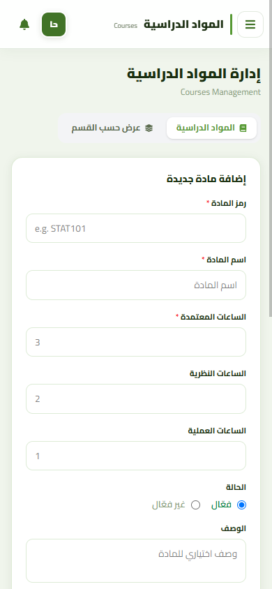 | 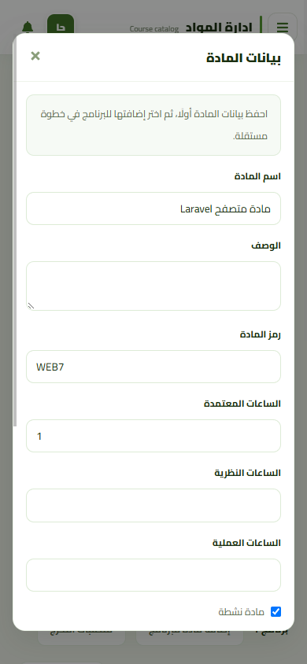 |
| 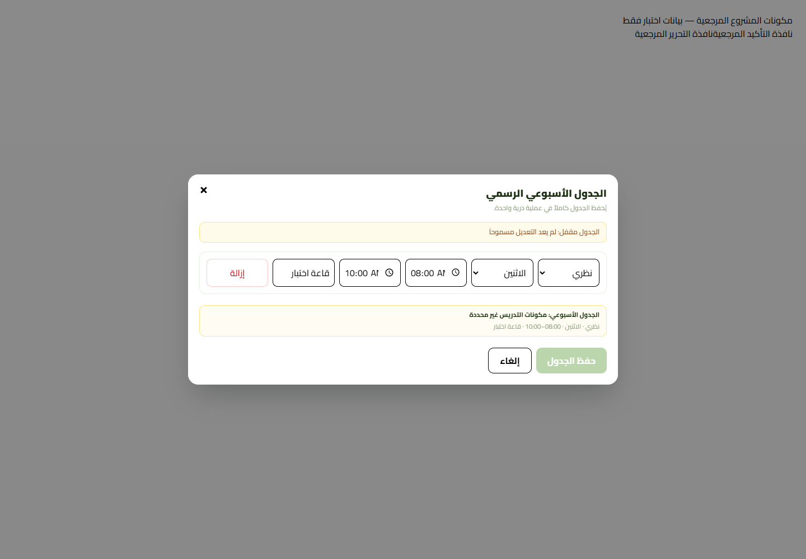 | 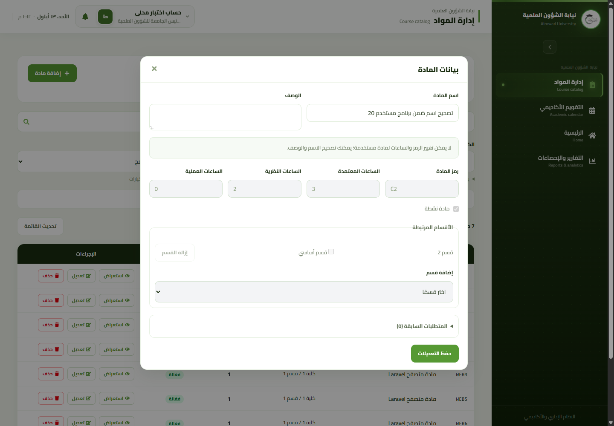 |
| 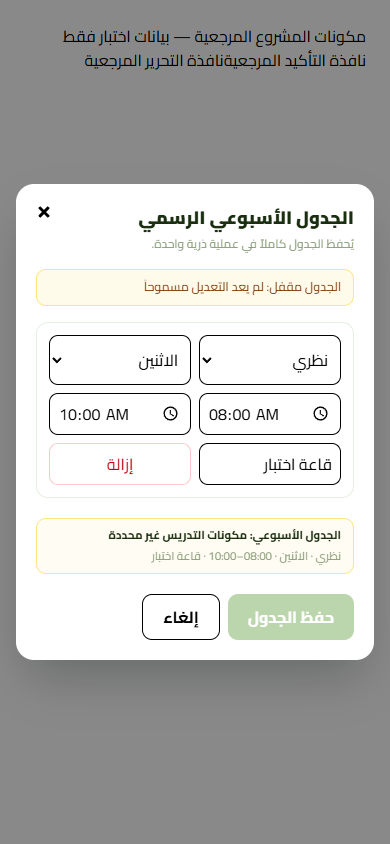 | 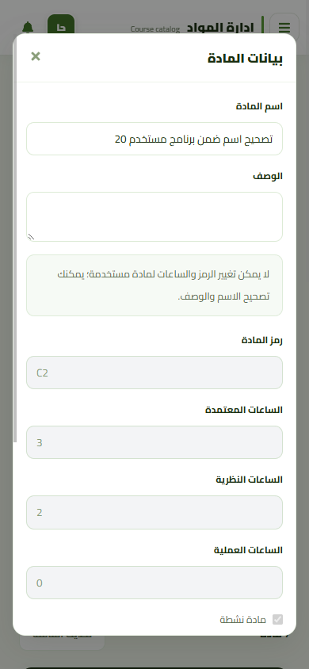 |
| 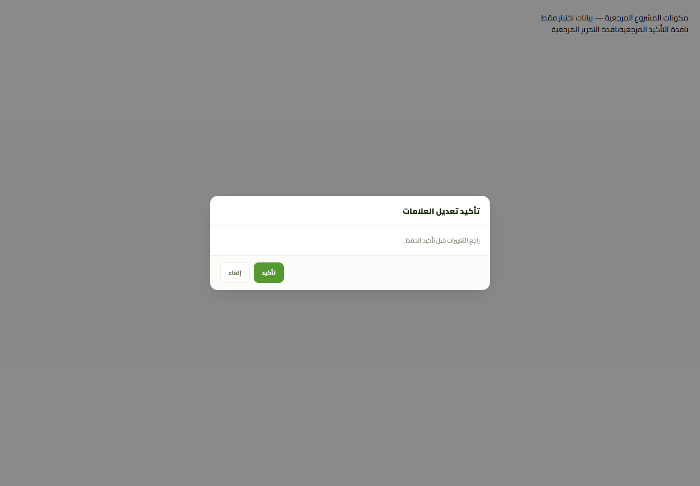 | 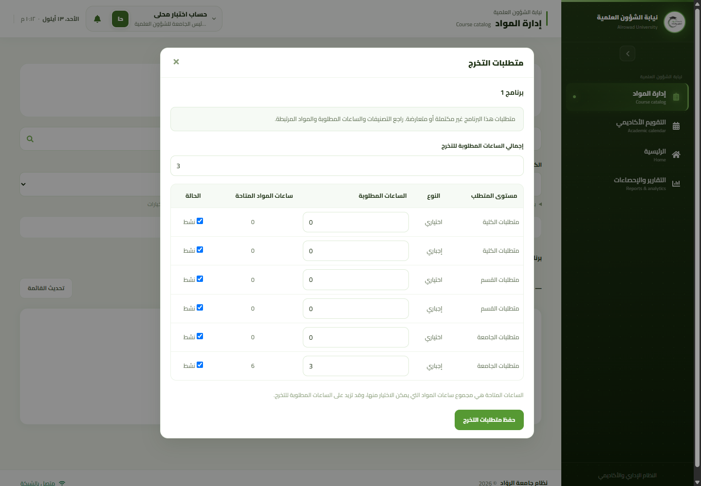 |
| 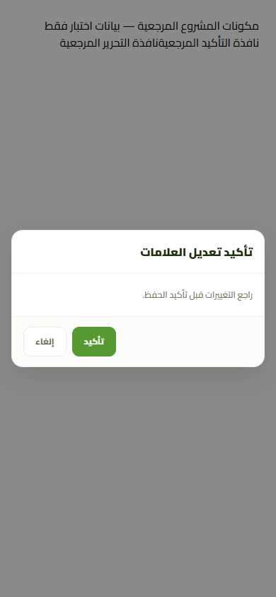 | 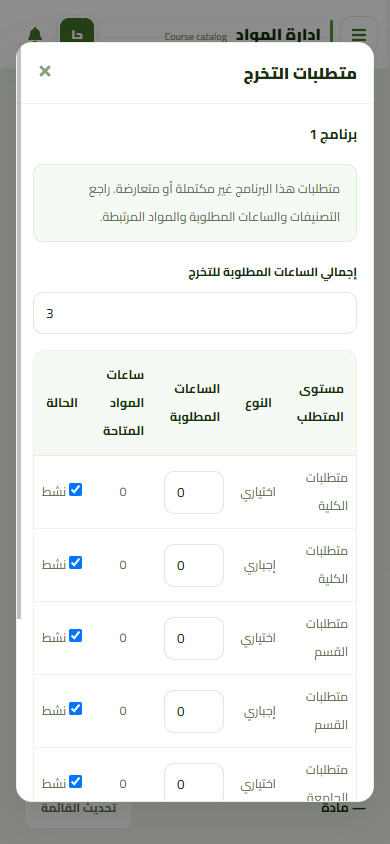 |

Sizes: 1440×1000 and 390×844. Long pages/modal bodies scroll deliberately; the
shared table keeps its horizontal scrolling on narrow screens. No page-level
horizontal overflow or viewport-clipped dialog was observed in these fixtures.
Arabic Cairo glyphs were verified using Chrome's platform-font report with local
fonts disabled, not only computed font-family. This is not a full accessibility
audit or coverage of every viewport/dataset.

## Existing-program operation matrix

| Operation (authorized actor, owned scope) | Existing used program | Effect/history rationale |
| --- | --- | --- |
| Correct course name/description | Allowed | Shared display correction; no credits, eligibility or grade recomputation |
| Add a new independent catalog course | Allowed | No membership or graduation budget side effect |
| Add that course to the used program | Blocked | Current membership affects existing students' eligibility/progress; no per-student curriculum version exists |
| Change a membership's scope/type/advisory attributes/activity | Blocked | The existing link and its requirement interpretation remain historical context |
| Change hours/code/activity of a used course | Blocked | Would reinterpret existing offerings/academic evidence |
| Remove a membership | Blocked | Would remove current requirement evidence for prior/current students |
| Change required graduation hours/groups | Blocked | Would reinterpret progress and graduation requirements |

Usage includes students (also soft-deleted), admission applications, Ministry
matches, ordinary/supplementary offerings and progression/graduation decisions.
Absence of marks is **not** sufficient to release these locks. The admission-only
case is explicitly exercised through HTTP. No lock was weakened. This is **not
complete versioned management of curricula already used by students**; making
such academic changes safely requires a separately designed version/history model.

## Read performance and concurrency

Ordinary catalog/list/detail/options GETs no longer acquire the singleton write
lock or history-row `FOR UPDATE` locks. `snapshot()` reads the monotonic epoch
before a read transaction and again **after its snapshot ends**. A mismatch rejects
the whole response with `academic_catalog_stale`; it never returns mixed data or
retries a mutation. The outer fence matters under both READ COMMITTED and
REPEATABLE READ. A mutation's nested response projection stays under its existing
writer lock.

All existing write serialization, 57 triggers, first-use proofs and legacy CRUD
protections remain. The epoch remains global, so unrelated catalog/reference/use
writes can still conservatively invalidate an edit. This repair reduces read-side
lock contention; it does not claim elimination of writer contention or deadlocks.

Executed tests retain legacy CRUD ABA, first-offering-use stale proofs, generic
offering paths and history locks. A MySQL-query-grammar test on SQLite proves GETs
do not request `FOR UPDATE`; a deterministic ABA fence simulation proves rejection
without replay. **Neither proves InnoDB locking/trigger/concurrent throughput.**
No isolated MariaDB/MySQL engine was available; multi-connection races and SQL
package execution remain unexecuted. No production database was contacted.

## Executed verification

- **41 Laravel HTTP/SQLite tests, 293 assertions passed** across scientific catalog
  behavior/contract, primary promotion, courses API, advisory metadata and Phase 1
  offering governance. Six new regressions cover automatic/missing/ambiguous group
  resolution, explicit budget input, admission-only locks and non-locking epoch reads.
- **186 dependency-free Node tests passed**; these are static/pure-logic checks.
- **11 recorded synthetic-browser scenarios passed**, plus actual Cairo/mobile
  checks: draft/sidebar/back/forward, 409/422, pending/lost write, delayed reads,
  independent resource writes, deletion confirmation, identity and GET-403 cleanup.
- **5 real browser/Laravel/SQLite scenarios passed**: used-program text save,
  independent create, separately confirmed group-resolved link, unlink/relink
  without duplicate creation or budget mutation, and real server-epoch 409 that
  retains the proposed edit. No catalog API responses are mocked in this mode.
  Local harness authentication uses Sanctum's testing identity; production login,
  live MariaDB and production authorization provisioning are not tested.
- Existing reference pages/forms/dialogs rendered at both sizes. The in-app browser
  bridge failed; standalone existing Chrome/CDP performed these checks.
- Production Vite build and targeted ESLint passed. Existing large-bundle warning
  remains. Full repository lint still fails **90 errors / 16 warnings**, exclusively
  in unrelated existing files; no lint suppression or unrelated cleanup.
- PHP syntax passed on all six PHP files changed in this correction. Composer
  validate and locked platform checks passed. No dependency installation.
- Independent PHP contracts: **27 passed, 2 old PR-specific boundary failures**:
  `academic_calendar_schema_compatibility_repair_contract.php` expects the already
  existing policy service to be absent; `supplementary_exam_end_to_end_hardening_contract.php`
  prohibits this PR's explicitly authorized original manual SQL package. Neither
  assertion was weakened. `git diff --check` passed.

### Reproduce browser checks without a production connection

Use the existing dependencies and a separate temporary Chrome profile with debug
port 9223; preview the production build on 127.0.0.1:4173. Each harness run needs
a fresh `about:blank` tab and closes only that tab. Set `CATALOG_TEST_OUTPUT` to
a temporary artifact directory, then run
`node frontend/tests/browser/scientific-course-management.mjs` for synthetic mode.

For real Laravel mode, set `SCIENTIFIC_CATALOG_TEST_DB` to a **new** file directly
under the OS temporary directory named `scientific-catalog-{UUID}.sqlite`.
Run `php backend/tests/browser/scientific-catalog-server.php --init`, then
`php -S 127.0.0.1:8183 backend/tests/browser/scientific-catalog-server.php` with the
same variable. The harness refuses an existing initialization file, non-temporary
paths, non-SQLite configuration and non-loopback requests; it never loads production
connection settings. Set `CATALOG_LARAVEL_URL=http://127.0.0.1:8183` for the Node run.
Only fixture course-management APIs are forwarded. Fixture schema/seeds are shared
with PHPUnit, not a production migration or seeder.

For reference captures, unset `CATALOG_LARAVEL_URL`, run Vite dev locally on 4174,
and set `CATALOG_REFERENCE_URL=http://127.0.0.1:4174`. The new reference HTML/JSX
under `tests/browser` is test-only and does not enter the production build/routes.
