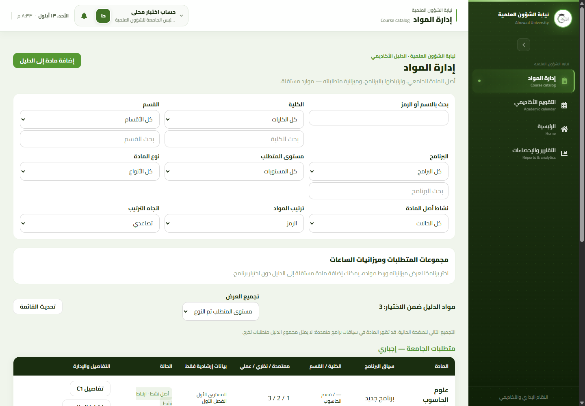
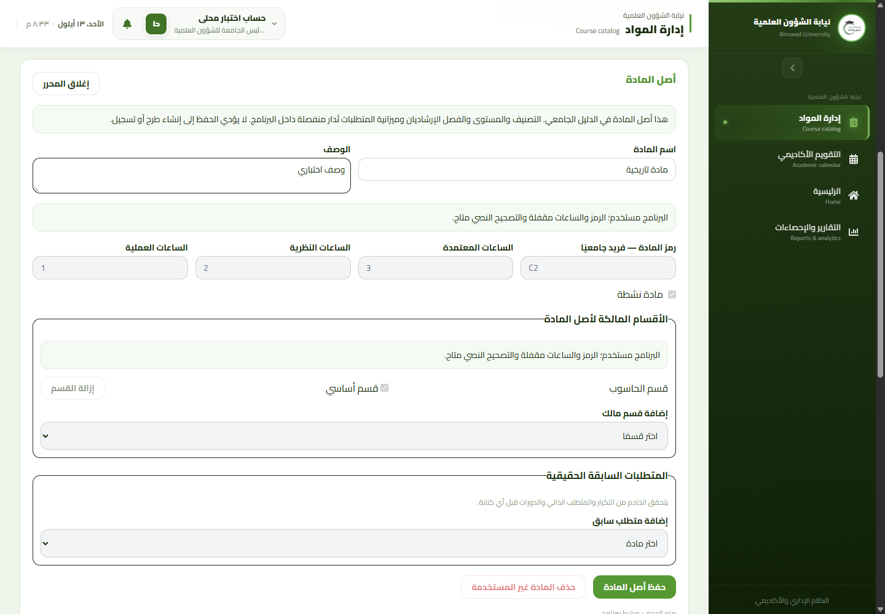
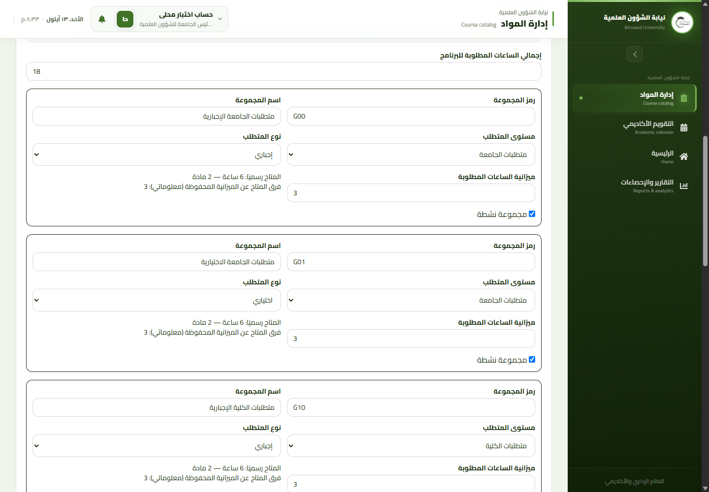
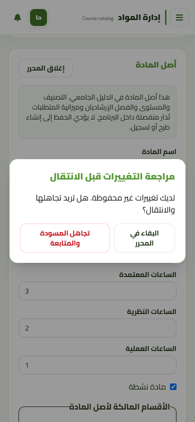

# Scientific VP course management

The in-place PR #132 repair is documented in
[the repair report and direct visual comparisons](scientific-course-management-repair.md).
Its verification supersedes the original-head verification and screenshots below.
The original SQL package and deployment instructions remain unchanged.

## Scope and audited baseline

Branch: `codex/scientific-vp-course-management`. Started from a clean, fetched
`origin/develop` at `6f9b2f2582a8dce42b86b3d9637a082826e9703d` (including the
self-hosted Cairo change). No repository `AGENTS.md` was present. The supplied
`alrowad_uni_rust13-9.sql` was inspected as schema/reference data only, never
executed, imported, modified, or treated as instructions.

The existing Scientific VP shell, `DataScopeService`, effective RBAC,
`CourseRequirementClassification`, `AcademicRequirementService`, and
`UserActivityLog` remain the sources of truth. The audit found no digital
academic-plan approval/version workflow. None is added here. An active
`ProgramCourse` means current curriculum membership, **not Scientific VP plan
approval**. Ordinary semester-offering approval remains a separate workflow.

| Resource | Existing authoritative storage and semantics |
| --- | --- |
| Global course origin | `courses`: globally unique `course_code`, name, description, credit/theoretical/practical hours, activity. No per-program hours or multilingual-name columns exist in the inspected contract. |
| Ownership | `course_departments`, department and college hierarchy. Visibility through one program is not permission to edit the shared origin. |
| Program membership | `program_courses`: program/course unique pair, mandatory/elective type, activity, advisory academic level and recommended semester. The inspected production columns require non-null level/semester; old null values remain readable. |
| Requirement classification | `program_course_requirement_groups` links a membership to an `academic_requirement_groups` row of the same program, scope and type. University/college/department and mandatory/elective are separate dimensions, producing six pairs. |
| Budgets | `academic_requirement_groups.required_credit_hours` and `academic_programs.total_credit_hours`. Available active course credits are a separate pool, never silently substituted for a requirement budget. |
| Prerequisites | `course_prerequisites`, including optional `minimum_result_status_id`. Reject self-reference and graph cycles atomically. |
| Academic results | Existing result, requirement-progress and graduation services remain unchanged. No parallel GPA or historical curriculum interpretation is introduced. |

## API, authority and ownership

Page: `/vp/scientific/courses`, inside the existing Scientific VP layout.
Navigation, home card and route use the same predicate. The Administrative VP
receives no page or new permission. Cairo, RTL, green tokens, shell and table
components are reused; no global redesign or PDF changes.

API prefix: `/api/v1/vice-presidency/scientific/course-management`.

| Method | Relative path | Purpose |
| --- | --- | --- |
| GET | `/options` | Scoped, searchable and paginated colleges/departments/programs/courses and reference choices |
| GET | `/courses` | Server-filtered, sorted, paginated catalog and full-selection summaries |
| POST | `/courses` | Create an independent course origin |
| GET / PUT / DELETE | `/courses/{course}` | Detail with lock reasons / update / explicit safe deletion |
| GET | `/programs/{program}` | Program, groups, available pools, budgets and canonical configuration warning |
| PUT | `/programs/{program}/requirement-groups` | Explicit program budget/group editing, not a side effect of adding a course |
| PUT / DELETE | `/programs/{program}/courses/{course}` | Membership/classification edit or unlink, not origin deletion |

All reads require an active account, actual active `vice_president_scientific`,
assigned effective `vice_presidency.scientific.access` and
`vice_presidency.scientific.courses.view`, plus actual applicable academic scope.
Writes additionally require assigned effective
`vice_presidency.scientific.courses.manage`. Scope comes from existing
PRES-backed university / college / department / program resolution, not an
implicit super-admin grant. A super-admin alone cannot impersonate Scientific
VP; a genuinely assigned VP is evaluated normally. The manual SQL maps the two
new permissions only to the existing Scientific VP role, and creates no users,
roles or scopes. Other controllers retain their previous authority.

Lower-scoped actors may see a shared course through their own program but may
edit its origin only when its ownership is wholly within their allowed scope.
University-wide shared ownership requires actual university scope. Program-only
scope does not grant creation of new global origins. Detail projections omit
out-of-scope program/prerequisite identities. Hierarchy mismatches are validated
server-side; hiding controls is not authorization.

## History locks and distinct editing contexts

| Context | Allowed changes | Early UI explanation |
| --- | --- | --- |
| Unused course within owned scope | Supported origin fields, explicit ownership/prerequisites; no credit = theory + practice assumption | Origin editor and shared-impact confirmation |
| Used course / course in a used program | Name/description correction only | Academic and relationship fields disabled with reasons next to the fieldsets; text remains editable |
| Unused program | Explicit membership/classification and explicit group/budget editing | Separate program section and confirmation |
| Used program | Read-only membership/classification/budgets | Lock reason is loaded before mounting editable controls |
| Linked course deletion | Blocked, with enumerated relationship reasons | Distinct from unlinking one unused program membership |
| Unlinked, unused owned course | Explicit deletion; ownership links removed deliberately within the transaction | No cascade into student/grade history |

“Used” is intentionally conservative: existing students (including soft-deleted
rows), ordinary/supplementary offerings, admissions, matched Ministry records,
graduation or progression decisions freeze the referenced program. Existing
offerings also freeze a course directly. Current `registered` status is not the
only evidence: later drop, cancellation, graduation, inactivity or soft deletion
does not make historical data safe to reinterpret. No historical backfill,
record deletion or fabricated plan version is performed.

Requirement groups and budgets are explicitly separate from global course
creation. Program pool counts are computed in SQL from active memberships and
active courses. Required hours, available hours and their signed difference are
displayed separately. The difference is informational; only the existing
`AcademicRequirementService::assertProgramGraduationConfiguration()` supplies
configuration warnings. Incomplete unused curricula may be prepared without
silently repairing their budget. Cross-program catalog counts are not labelled
graduation totals. Group summaries cover the full filtered selection. The repaired
UI uses one course-identity table; linked programs are shown in details, not duplicate rows.

## Cross-writer concurrency and ABA protection

One manual control table, `academic_catalog_control`, holds an unsigned BIGINT
monotonic `revision` (returned as a string), schema version and readiness flag.
It is not a value hash, timestamp or academic-plan version. A change followed by
restoration still advances the epoch. The revision is catalog-wide: unrelated
catalog/use changes can conservatively invalidate an editor, intentionally.

The package contains 57 BEFORE triggers covering INSERT/UPDATE/DELETE on seven
catalog tables, seven usage/history tables and five reference/hierarchy tables.
Every participating write takes the singleton control lock and advances its
epoch, including query-builder writes outside the new service. History-check
stored functions use current locking reads, rather than a repeatable-read
snapshot that could miss a just-committed first use. Readiness false/missing
control metadata fails closed. Existing data is not rewritten.

| Other writer audited | Protection |
| --- | --- |
| Generic Course / ProgramCourse / CourseDepartment / CoursePrerequisite / AcademicProgram CRUD | Shared `CatalogCrudController` acquires control lock before mutation, preserves existing payload/authorization, checks historical locks; prerequisite CRUD also validates the graph. Triggers cover direct writers. |
| Dean and generic offering creation | `CourseOfferingContextService` captures an epoch before resolving current curriculum; rechecks it under the control lock before the canonical closed offering insert. No stale pre-edit curriculum proof may establish first use. |
| Generic offering identity update | Retains the destination-context proof/control lock through its existing outer offering transaction. It can also be a program's first use. Existing OPEN identity and governance rules are unchanged. |
| Registration creation/reactivation | Already requires existing Student and CourseOffering context. Those persisted history roots freeze the affected curriculum before registration; no student/advisor workflow or registration gate is replaced. |
| Supplementary, admissions, Ministry and student history writers | Usage-table triggers serialize first use/invalidate cached editor revisions. Their business transitions are not reimplemented. |

The old offering/registration lock order is not redesigned. An interaction with
the new control lock can select either transaction as an InnoDB deadlock victim;
this is a controlled 409, with no automatic mutation replay and no SQL leaked to
the client. **This is not a claim of deadlock-free behavior.** Real InnoDB
concurrency and SQL execution remain unverified locally (see below).

## Drafts, races and uncertain writes

Catalog/lookup reads are keyed by applied context and use abort plus sequence
checks. Course/program membership editors require matching revisions before
initializing. Same-context refresh does not re-seed an active draft. A 409 keeps
the original baseline and proposed values; the operator must inspect the newly
fetched official state and explicitly discard before a new baseline is used.
No old draft is automatically attached to a fresh revision. Network write
failure is uncertain, not proof of rollback; another write is blocked until
official inspection. Successful writes and subsequent list refresh failures
are reported separately. Duplicate-code 422 keeps inputs editable and shows an
Arabic error below the code field.

`useBlocker` covers sidebar and SPA back/forward navigation, with a native RTL
confirmation dialog; `beforeunload` covers leaving the document. Pending writes
cannot be discarded. Authorization loss (identity change or authoritative
401/403 on a read/write) immediately purges displayed data and drafts.

## Manual deployment package — NOT EXECUTED

Directory: `backend/database/sql/scientific-course-management/`.

1. Rehearse on an isolated MariaDB 10.11 copy first, including the concurrency
   cases below. Back up normally and arrange an application maintenance window.
2. Run read-only `00_preflight.sql`; inspect every section and require visible
   `OVERALL | READY`. It checks required column/key/FK semantics, InnoDB, existing
   uniqueness, RBAC source metadata and reserved object compatibility. Base
   physical RBAC objects are assumed deployed by the static reporting queries;
   a missing prerequisite SQL error is a STOP, never a READY result.
3. While all application/worker writers are stopped, run `01_apply.sql` against
   its explicit `alrowad_uni_rust` target with a client supporting DELIMITER.
   **Stop on the first error.** Existing compatible owned objects are resumable;
   `is_ready=0` fences writes while routines/triggers are replaced. It adds the
   one control table, package routines/triggers and the two narrow Scientific
   role permission mappings. It does not rewrite course/program/student data.
4. Run read-only `02_verify.sql` and require `OVERALL | PASS`. Deploy/release the
   backend and built frontend together only after successful verification.
   Refresh the operator's authenticated identity so assigned permissions appear.
5. If any step fails, keep maintenance enabled, inspect the error, and resume the
   owned package deliberately. Do not drop the control table/triggers or reset
   revisions to bypass readiness/history protection. No destructive rollback is
   supplied. Generic catalog CRUD now requires this package; do not deploy its
   write paths alone before the schema is ready.

The apply file uses stored routines/triggers, unlike a phpMyAdmin-safe static
preflight. The deployment DBA must verify definer, routine/trigger privileges
and binary-logging policy; this PR issues no database GRANT or global setting
changes. Review MariaDB's [stored-function limitations](https://mariadb.com/docs/server/server-usage/stored-routines/stored-functions/stored-function-limitations)
and [routine binary-logging requirements](https://mariadb.com/docs/server/server-usage/stored-routines/binary-logging-of-stored-routines).
Documentation review does not substitute for executing the package on a test DB.

Required remaining production-engine rehearsal: catalog edit vs first Student
or CourseOffering insert; generic destination-program identity update vs catalog
edit; ABA through another CRUD writer; simultaneous duplicate code; prerequisite
edge races; deadlock rollback with zero partial audit/relationship writes;
resuming interrupted package installation and verifying all guards.

## Executed verification (2026-09-13)

| Check | Actual result |
| --- | --- |
| Targeted Laravel HTTP/SQLite suites, existing dependencies | **35 passed, 269 assertions**: new behavior/contract, primary promotion, courses API catalog, advisory metadata, Phase 1 offering governance |
| New behavior class | 14 real HTTP/SQL tests: authorization/scopes, shared ownership, six classifications, required vs available hours, ABA through legacy CRUD, history locks/text corrections, graph rollback/audit, safe deletion, stale first-use proofs, partial schema and bounded queries |
| All dependency-free frontend Node tests | **184 passed** (static/pure-logic evidence, not rendering) |
| Production Vite build | Passed; existing large-chunk warning remains |
| Targeted ESLint, all changed frontend code and new tests | Passed, no errors/warnings |
| Real production-build Chrome harness | **13 scenarios passed**, intercepted synthetic API only; desktop 1440×1000 and mobile 390×844; Arabic heading glyphs verified as actual custom Cairo via CDP with local fonts disabled; no document horizontal overflow |
| Browser scenarios | Text edit on locked origin; sidebar/back/forward guards; refresh preserves draft; 409 inspection/discard; 422 correction; pending/uncertain write protection; delayed filters; distinct budgets/membership; independent create; confirmed delete; mobile dialog; identity and GET-403 cleanup |
| PHP syntax | All 20 changed/new PHP files passed |
| Dependency-free PHP contracts | **27 passed, 2 failed** for old task-specific boundaries described below; new scientific catalog contract passed |
| Composer validate / locked platform requirements | Both passed on PHP 8.4.14; no dependency installation |
| Full repository ESLint | Failed: **90 errors, 16 warnings** in existing unrelated files; targeted changed-file lint is clean |
| Additional wider PHPUnit run | 52 passed / 1 pre-existing fixture error in a 53-test run: Phase 4 weekday test's docblock data provider is not recognized by installed PHPUnit 12 (`Too few arguments`). Test file unchanged; not skipped or weakened. |
| SQL package execution / multi-connection MariaDB concurrency | **Not executed**: no isolated MariaDB/MySQL engine, CLI or local listener available. SQLite trigger analogues are not InnoDB lock proof. |
| Live browser-to-Laravel integration / production verification | **Not executed**. Local React browser fixtures and Laravel HTTP/SQLite tests are separate evidence. No claim of full production acceptance or merge readiness. |

The two failing independent contracts were left intact:

- `academic_calendar_schema_compatibility_repair_contract.php` requires the
  Phase 3 policy service to be absent, but it already exists in the audited base.
- `supplementary_exam_end_to_end_hardening_contract.php` forbids any SQL file in
  the current diff, an old PR-specific constraint incompatible with this task's
  explicitly authorized manual SQL package.

Full lint failures include existing `CourseRequirementBadges.jsx`, Academic
Calendar, Dean and older VP files. No unrelated lint cleanup is included. The
default PHPUnit XML launch did not complete locally; the successful command
used the existing autoloader, explicit test files and isolated SQLite environment
with `--no-configuration`, not production connection settings.

### Reproduction

From `backend`, set `APP_ENV=testing`, `DB_CONNECTION=sqlite`,
`DB_DATABASE=:memory:`, empty `DB_URL`, `CACHE_STORE=array`,
`SESSION_DRIVER=array`, `QUEUE_CONNECTION=sync`, then:

```text
php vendor/phpunit/phpunit/phpunit --no-configuration --bootstrap vendor/autoload.php tests/Feature/ScientificCourseManagementTest.php tests/Feature/ScientificCourseManagementContractTest.php tests/Feature/ExamBoardCourseDepartmentPrimaryPromotionTest.php tests/Feature/CoursesApiCatalogFeatureTest.php tests/Feature/CourseOfferingAdvisoryMetadataBehaviorTest.php tests/Feature/SemesterOfferingGovernancePhase1BehaviorTest.php
php tests/Contracts/scientific_course_management_contract.php
composer validate --no-check-publish
composer check-platform-reqs --lock
```

From `frontend`: run `node --test tests/*.test.mjs`, `npm run build`, and
`npm run preview -- --host 127.0.0.1`. Launch a separate temporary Chrome profile
with `--headless=new --remote-debugging-port=9223 --remote-allow-origins=*` and a
fresh `about:blank` tab. Set `CATALOG_TEST_OUTPUT` to a temporary artifact directory
and run `node tests/browser/scientific-course-management.mjs`. The harness blocks
external resources, intercepts all API traffic with synthetic responses and
closes only its own fresh tab afterward. Never use a real authenticated browser
profile or a production account. No packages are downloaded by the harness.

## Screenshots (synthetic local data only)

The in-app browser bridge was unavailable in this session; the repository's
standalone Chrome/CDP approach executed the production React bundle instead.
The Superdesign context audit guided reuse of the existing shell/components;
its remote canvas operation was unavailable, so no external design was used.
These screenshots were visually inspected; this is not a complete accessibility
audit or a claim that every application screen was inspected.









No server deployment, production SQL execution, migration, seeder, dependency
change, grade/result calculation change, academic-plan approval workflow, student
registration workflow rewrite or Administrative VP authority grant is included.
