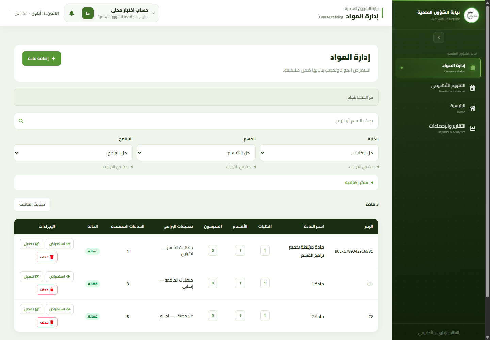
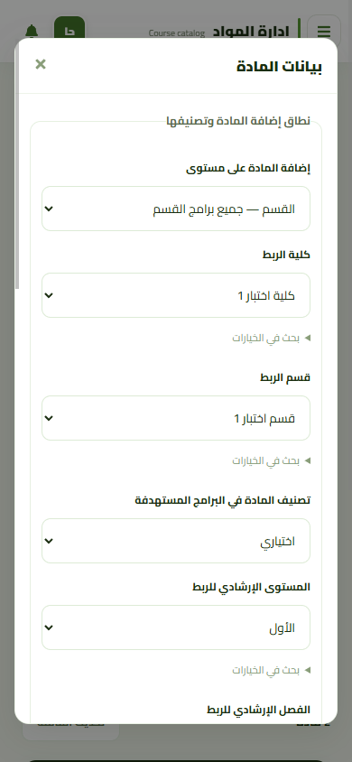

# Scientific course scope distribution and association details

## Scope and base

The user explicitly confirmed that university/college/department selection means
ALL existing programs in that scope, not a classification within one selected
program. PR #132 was merged while this follow-up was being prepared. With the
user's approval this is a separate branch, `codex/scientific-course-scope-distribution`,
from `origin/develop` at `118cdec119ba59be996e6c86a3307aa402d2563f`.
That merge has exactly the same tree as the previously reviewed `a78b0c5`.

## Semantics

- Course rows display distinct visible college, department and instructor counts.
  Counts open native RTL detail dialogs instead of listing organization names
  inline. Departments/colleges include catalog origins and program memberships;
  filters select courses but do not hide their other authorized associations.
  Out-of-scope program/department identities remain excluded.
- Academic classifications remain per ProgramCourse. Different scope/type pairs
  are displayed, not collapsed into an invented global course classification.
  Origin-only department links do not fabricate academic requirement mappings.
- Instructor counts use distinct `course_instructors.faculty_member_id` identities.
  Details expose only names, primary/supporting link and active/inactive link
  status. These are explicitly catalog links, NOT effective term assignments.
- New-course forms retain an explicit catalog-only option. Selecting university,
  college or department additionally requires mandatory/elective, common advisory
  level/semester and an explicit confirmation. College selection constrains the
  department lookup; changing scope/college clears dependent selections.
- All course lookup options display `name (code)`, including existing-course and
  prerequisite selectors. Saved prerequisites retain their code when reopening
  the editor. Equal names remain distinguishable and searches still accept codes;
  presentation labels never enter relationship writes.
- `GET .../course-management/distribution-preview` returns all authorized target
  programs, reasons preventing application and the existing catalog revision.
  `POST .../course-management/courses` accepts the optional `distribution` and
  confirmed advisory values. Existing individual course/membership APIs remain.
- The server resolves targets itself. University needs actual university scope;
  a partial scope cannot silently stand for all college/department programs.
  Unknown fields/client program subsets and inconsistent hierarchy are rejected.
- Used programs, inactive hierarchy, missing/ambiguous active requirement groups
  or an empty target set prevent the ENTIRE operation. No partial success, no
  silently omitted programs, no automatic group creation or budget adjustment.
  This means an already-used program can block university-wide distribution.
- The existing catalog control lock/revision encloses target resolution, sorted
  program/group locks, Course creation, all memberships/mappings and audit writes.
  Existing SQL triggers still cover other CRUD and history writers. A changed
  revision is rejected; no automatic retry or value-fingerprint replacement.
- Targets are the programs existing at execution time. This is not a permanent
  rule that silently populates future programs. Existing memberships are never
  overwritten by this new-course-only operation.
- No production schema, SQL package, permissions, assignment workflow, grades,
  registration or requirement-budget rules changed. Test fixture schemas add the
  pre-existing instructor/faculty/employee columns needed by the read projection.

## UI references

Reused the current `ScientificCoursesPage`, `CatalogControls` dialogs/forms and
`frontend/src/components/table/DataTable.jsx`, compared with the saved actual
MariaDB desktop reference in `docs/images/scientific-course-management/mariadb/`.
No new shell, global CSS, font, color system or dependency. Direct implementation
without a separate Superdesign draft was explicitly approved by the user.

## Executed verification (local, 2026-09-14)

- 31 targeted PHPUnit HTTP/SQLite tests, 247 assertions: existing course tests plus
  10 new tests for complete scope sets, preview zero writes, all-or-none locks/group
  readiness, stale targets, permissions/hierarchy/confirmation, audit rollback,
  fixed preview query count, safe instructor fields, scoped associations and
  inactive/unknown input rejection and course codes beside identical names.
- 25 dependency-free Node tests passed (catalog, distribution, Exam Board catalog).
  These are pure/static checks, not React or Laravel integration evidence.
- Existing source/SQL catalog contract and all seven changed PHP syntax checks
  passed. Scoped ESLint passed. Vite production build passed (819 modules), with
  the existing large-chunk warning. Composer validate/platform checks passed.
- Original SQL package ran ONLY on disposable, guarded MariaDB 10.11.18:
  preflight READY; interrupted installation fail-closed; resume APPLIED;
  verify PASS; reapply APPLIED; verify PASS; unchanged fixture academic rows.
  All 24 existing independent-connection MariaDB verification scenarios passed,
  including CRUD/history races, deadlock/timeout mapping and both isolation-level
  read fences. These revalidate the shared protection, not every possible new
  distribution concurrency schedule or production-load behavior.
- Built React in isolated Chrome with local fonts disabled/external requests
  blocked: 3 new recorded scenarios exercised real loopback Laravel + MariaDB
  using synthetic fixture data/test authentication. Distinct counts/dialogs,
  early university lock warning, dependent college/department selectors, cancelled
  confirmation (zero writes), confirmed scope linking and unchanged budgets passed.
  Desktop 1440x1000 and mobile 390x844 dialog/page geometry were checked.
- All 11 existing Chrome scenarios passed with a synthetic API, including dirty
  sidebar/back navigation, pending saves, stale filters, lost responses and 409
  draft preservation; course-code lookup presentation also has a browser assertion.
  This is distinct from the live local Laravel tests above. The final course-label
  addition was verified by HTTP/SQLite, Node and the synthetic browser, not by
  rerunning the earlier MariaDB/browser distribution suite.

## Limitations and reproduction

No production SQL, real user data, deployment, or production authentication was
used. The in-app browser bridge failed (`sandboxPolicy` missing); the existing
standalone Chrome/CDP harness supplied the browser evidence instead.

`php artisan test --compact --filter=ScientificCourseManagementTest` cannot scan
the whole test tree: pre-existing `AcademicCalendarPhase5OccurrenceResponseTest`
declares `result()`, conflicting with PHPUnit's final method. The explicit
`vendor/bin/phpunit tests/Feature/ScientificCourseManagementTest.php
tests/Feature/ScientificCourseDistributionTest.php` command ran successfully.
This unrelated failure was not changed; no full-suite success is claimed.

Use the isolated MariaDB launch/package commands in
`scientific-course-management-mariadb.md` with a fresh fixture. Start its browser
server and a fresh temporary Chrome profile, then run the existing
`frontend/tests/browser/scientific-course-management.mjs` with
`CATALOG_LARAVEL_URL`, `CATALOG_DEBUG_URL`, `CATALOG_TEST_OUTPUT` and
`CATALOG_DISTRIBUTION_ONLY=1`. Run without the last two mode-selection variables
(`CATALOG_DISTRIBUTION_ONLY` and `CATALOG_LARAVEL_URL`) for the 11 synthetic
regressions. Install nothing and never point this harness at production.
